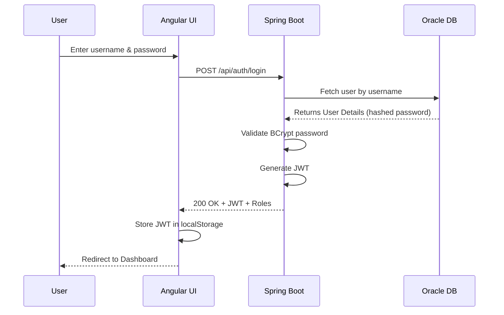
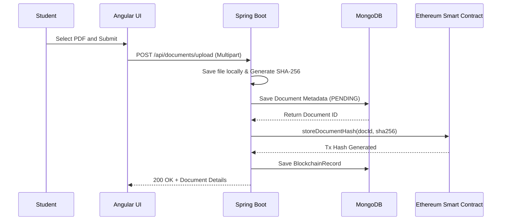
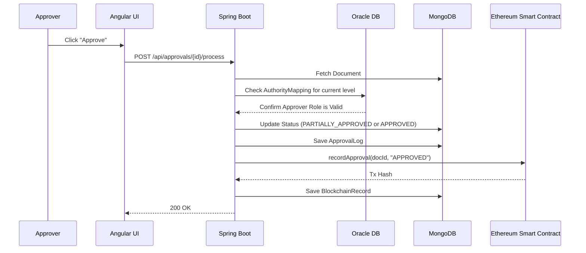
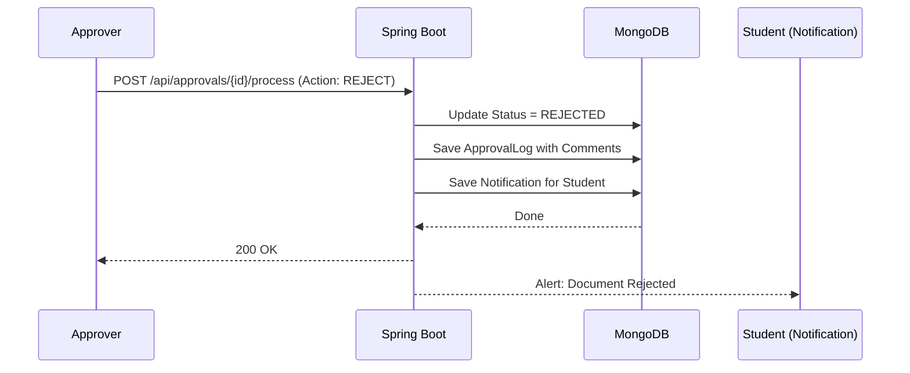

# System Architecture & Workflows

## STEP 7 — AUTHENTICATION FLOW

The system uses stateless JSON Web Token (JWT) authentication backed by Spring Security.

1. **User Registration:** 
   The user submits their details (username, password, department, role). The Spring Boot backend hashes the password using `BCryptPasswordEncoder` and stores it securely in the **Oracle DB**.
2. **Login Request:** 
   The Angular frontend sends a POST request with credentials to `/api/auth/login`.
3. **Authentication:** 
   `AuthenticationManager` verifies the credentials. If valid, `JwtUtils` generates a base64-encoded JWT signed with a secret key (`app.jwt.secret`).
4. **Token Storage:** 
   The frontend receives the JWT and stores it in `localStorage`. 
5. **Authenticated Requests:** 
   The Angular `JwtInterceptor` attaches the token as an `Authorization: Bearer <token>` header to all outgoing API requests. Spring Security's `AuthTokenFilter` validates the token and sets the user context for Role-Based Access Control (RBAC).

---

## STEP 8 — APPROVAL WORKFLOW FLOW

The system follows a strict, department-specific hierarchical workflow defined in the `authority_mappings` table.

1. **Document Upload:** A student or faculty uploads a PDF document.
2. **Hash Generation & Storage:** The backend generates a SHA-256 hash of the file. The file is saved locally (or to IPFS), the metadata is saved in MongoDB, and the hash is sent to the Ethereum blockchain via `Web3j` to guarantee immutability.
3. **Level 1 Routing:** The document enters the workflow at `Current Level = 1` and status `PENDING`. The Level 1 authority (e.g., Faculty Coordinator) sees it in their dashboard.
4. **Level-by-Level Approval:** 
   - When Level 1 approves, the backend checks if there is a Level 2 (e.g., HOD) mapped for that department.
   - If yes, the document becomes `PARTIALLY_APPROVED`, the level increments to 2, and it routes to the HOD.
   - This repeats until the final level (e.g., Dean or Principal).
5. **Final Approval:** When the maximum level is reached, the status becomes `APPROVED`. The final approval action is recorded immutably on the Blockchain.
6. **Rejection:** If any authority rejects the document, the workflow halts immediately, the status becomes `REJECTED`, and the uploader receives a notification.

---

## STEP 9 — SEQUENCE DIAGRAMS

### 1. User Login Flow

### 2. Document Upload & Blockchain Storage

### 3. Multi-Level Approval Flow

### 4. Rejection & Resubmission Flow

